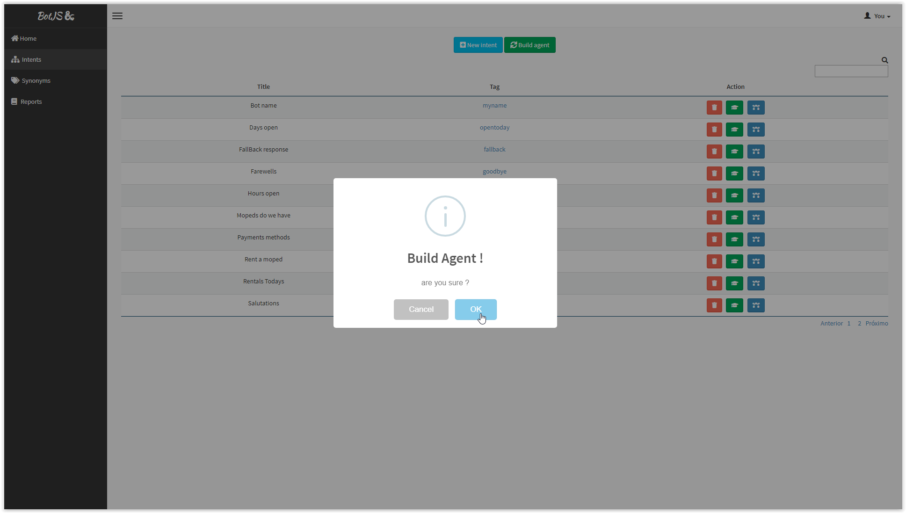

<p align="center"><a href="#" target="_blank" rel="noopener noreferrer"></a></p>

<p align="center">

</p>

<h2 align="center">ChatBotJS</h2>

A contextual Chatbot build with TensorflowJS and NodeJS

Install dependencies and run.

```sh

$ npm cd ChatBotNodeJS
$ npm install
$ npm start

```

Install dependencies and run with sample train.

```sh

$ npm cd ChatBotNodeJS
$ npm install
$ npm run seed
$ npm start

```

With docker.

```sh

$ npm cd ChatBotNodeJS
$ docker network create backend-bot
$ docker network create frontend-bot
$ docker-compose up --build

```

You can register your intents and the build agent.

| Register      | Train      | Anwser      |
|------------|-------------|-------------|
|  |  |  |


### Todo List

- [ ] Auth
- [ ] User CRUD
- [ ] Fallback dashboard
- [ ] Token for requests
- [ ] Metricis (Count request numbers ...)
- [X] Docker
- [X] Update Tensorflow JS
- [X] Log conversation and fallbacks
- [X] Data table for intents list
- [X] Optimizations on train and answer