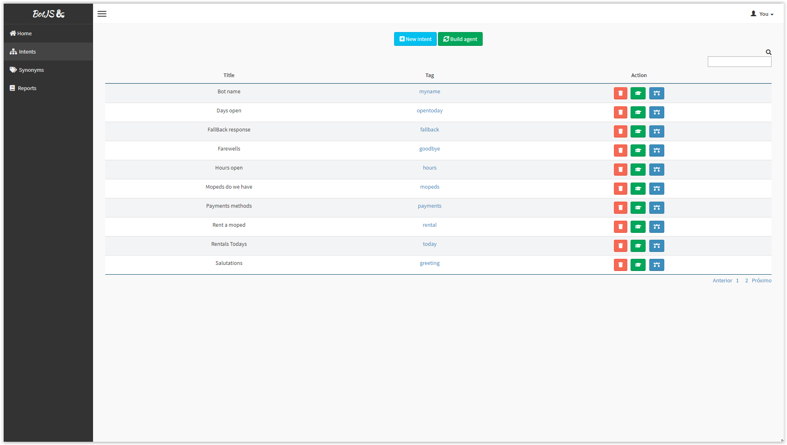
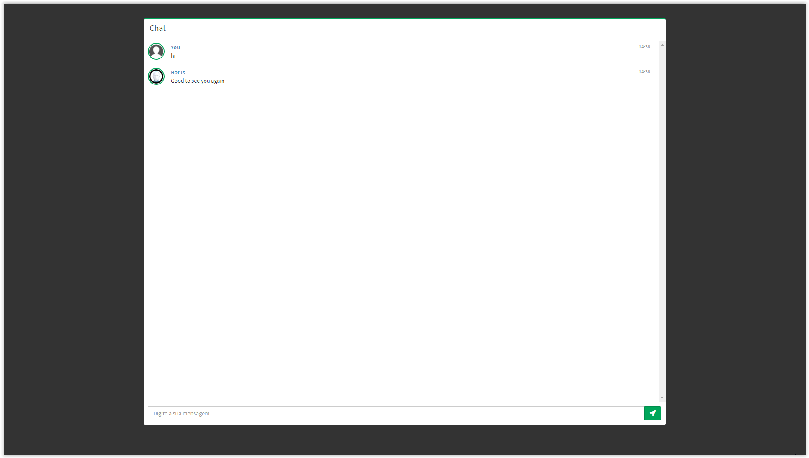

<p align="center"><a href="#" target="_blank" rel="noopener noreferrer"></a></p>

<p align="center">

</p>

<h2 align="center">ChatBotJS</h2>

A contextual Chatbot build with TensorflowJS and NodeJS

Install dependencies and run.

```sh

$ npm install
$ npm start bin/www

```

| Train      | Anwser      |
|------------|-------------|
|  |  |


In development.
